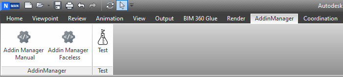
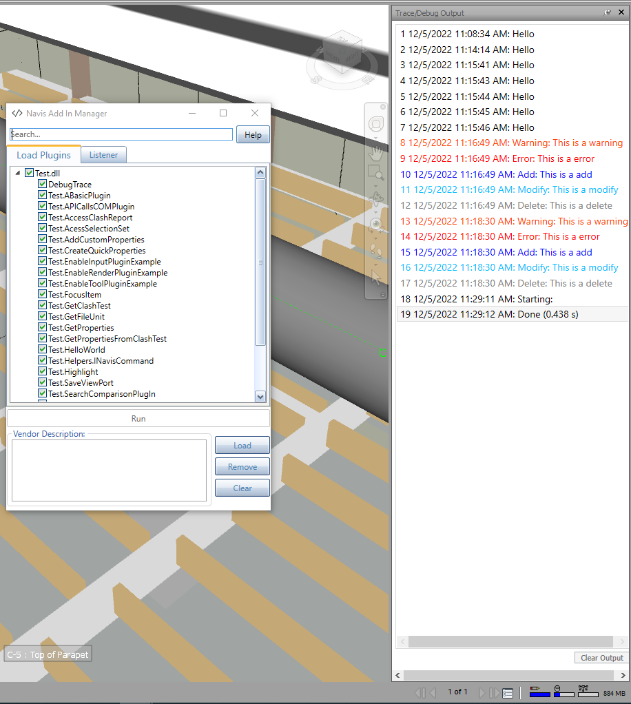

# Navisworks Add-in Manager


[](https://opensource.org/licenses/MIT)
<a href="https://twitter.com/intent/follow?screen_name=chuongmep">
</a>


[](../../actions)

## Summary



Usually, when developing and debugging an addin with [Navisworks](https://www.autodesk.com/products/navisworks/overview) API, user has to close & re-open [Navisworks](https://www.autodesk.com/products/navisworks/overview) each time
he/she modifies the addin code and wants to re-compile. But with **Add-In Manager**, user can modify and run the Addin.
directly without closing & re-opening [Navisworks](https://www.autodesk.com/products/navisworks/overview) again and again.This tool enables users to test plugin code within Navisworks without having to create an entire plugin first.This is a next branch from [Revit Addin Manager](https://github.com/chuongmep/RevitAddInManager)
to support multiple platform API for developer. With current technology, you can use [Hot Reload](https://docs.microsoft.com/en-us/visualstudio/debugger/hot-reload?view=vs-2022) to speed it up.But try this project it will be faster with any Addin.

- [x] [Revit Add-In Manager](https://github.com/chuongmep/RevitAddInManager)

- [x] [Navis Add-In Manager](https://github.com/chuongmep/NavisAddInManager)

- [x] [Cad Add-In Manager](https://github.com/chuongmep/CadAddInManager)

- [x] More...


### Some feature include:

- A newbie can create a new Add-in and explore **Navisworks API** easy with Add-in manager.
- Add-in manager
    - AddInManager Manual : Use for normal process load/unload addin
    - AddInManager Faceless : use for load last process before addin without UI
- Allow user know whether plugin can load successfully or not.
- No depend on any library from outside **Navisworks**.
- <kbd>F5</kbd> - Load fresh plugin don't need load again.
- <kbd>F1</kbd> - Go link open source report some error,bug or feature request.
- <kbd>Delete</kbd> - Quick remove by use right click or use from keyboard.
- <kbd>Crt + MouseWheel</kbd> - Zoom in/out by use mouse wheel in command plugin.
## Add-In Manager



### Command

- [x] AddInManagerManual
- [x] AddInManagerFaceless

A sample command to execute:

- Way one : use full with Add-in Manager
``` csharp
[Plugin("HelloWorld", "ChuongMep",DisplayName = "HelloWorld", ToolTip = "HelloWorld Navisworks AddinManager")]
    [AddInPlugin(AddInLocation.AddIn)]
    public class HelloWorld : AddInPlugin
    {
        public override int Execute(params string[] parameters)
        {
            //Code Here
            MessageBox.Show("Hello World",Application.Title);
            return 0;
        }
    }
   
```
- Way two  : use one quick run with Add-in Manager
``` csharp
    /// <summary>
    /// Only work for in AddinManager
    /// </summary>
    public class TestDontNeedUseAttClass : AddInPlugin
    {
        public override int Execute(params string[] parameters)
        {
            //Code Here
            MessageBox.Show("Hello World",Application.Title);
            return 0;
        }
    }
```
---

## Installation

Please follow last release at section [Release](https://github.com/chuongmep/NavisAddInManager/releases/latest)

Support Navisworks Version : 2020, 2021, 2022, 2023.
---

## Guideline

You can visit to wiki and read document or access by this [link](https://github.com/chuongmep/NavisAddInManager/wiki).

---

## Author

Originally implemented by [ChuongHo](https://github.com/chuongmep) with platform **WPF** and add more feature to fit
with the progressive development of modern technology. His focus is to work smarter and achieve the most effective
practices to enhance data utilization and digital collaboration among AEC parties.

---

## License

This sample is licensed under the terms of the [MIT License](http://opensource.org/licenses/MIT). Please see
the [License](License.md) file for full details.

---

## Contribute

**Add-In Manager** is an open-source project and would _be_ nothing without its community. You can make suggestions or
track and submit bugs via
Github [issues](https://docs.github.com/en/issues/tracking-your-work-with-issues/creating-an-issue). You can submit your
own code to the **Add-In Manager** project via a
Github [pull request](https://docs.github.com/en/pull-requests/collaborating-with-pull-requests/proposing-changes-to-your-work-with-pull-requests/about-pull-requests)
.

Many Thanks all contributors for this repository. Feel free to contribute!
Please refer to the [CONTRIBUTING](CONTRIBUTING.md) for details.

<a href = "https://github.com/chuongmep/NavisAddInManager/graphs/contributors">
  
</a>

---

## Sponsors


Thanks for providing a free All product IDE for this project

---

## Credits

- Credit to [icons8.com](https://icons8.com) for the Navis Add-in Manager icons.
- Credit to [Nice3point](https://github.com/Nice3point) for the CI/CD template.
- Website helped me resize icon : [https://resizeappicon.com/](https://resizeappicon.com/)
